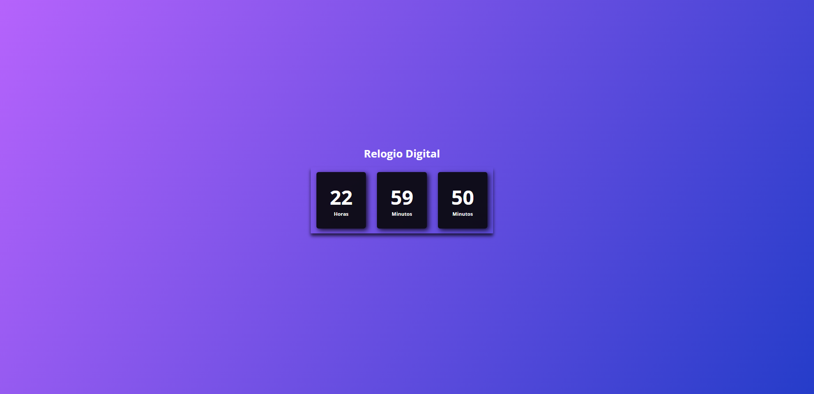

📌 Relógio Digital

Um projeto simples e funcional de um relógio digital desenvolvido com foco em praticar e evoluir minhas habilidades em JavaScript, além de reforçar conceitos de HTML e CSS.
## 📷 Preview do Projeto

🚀 Sobre o projeto

Este projeto exibe um relógio digital em tempo real, mostrando horas, minutos e segundos, atualizado automaticamente a cada segundo.

A proposta principal foi criar algo visualmente agradável, enquanto praticava manipulação de tempo e atualização dinâmica do DOM com JavaScript.

💡 Objetivo

O objetivo deste projeto foi:

Praticar lógica de programação com JavaScript
Trabalhar com funções como setInterval
Manipular elementos do DOM
Melhorar organização de código
Criar um layout simples e moderno com CSS

Mesmo sendo um projeto básico, ele é muito importante para consolidar fundamentos essenciais.

🛠️ Tecnologias utilizadas
HTML5
CSS3
JavaScript
🎨 Layout

O design conta com:

Fundo com gradiente moderno
Cards individuais para horas, minutos e segundos
Estilo clean e centralizado
🔧 Como funciona

O relógio utiliza a função setInterval para atualizar os valores a cada segundo, capturando o horário atual através do objeto Date do JavaScript.

📈 Evolução

Este é um projeto inicial, e pretendo futuramente:

Adicionar novos projetos ao portfólio
Melhorar o design com animações
Implementar modo escuro/claro
Adicionar funcionalidades extras
📎 Observação

Este projeto faz parte da minha jornada de aprendizado em programação. Ainda estou no início, mas estou constantemente evoluindo e buscando melhorar cada vez mais 🚀
